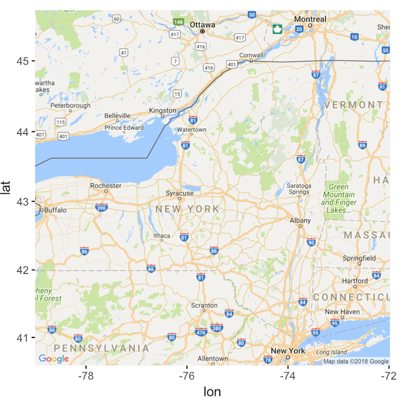
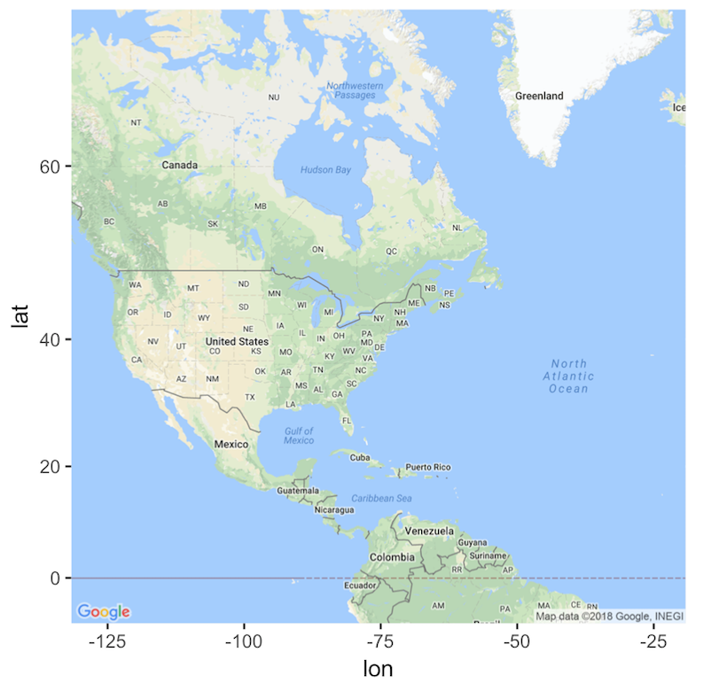
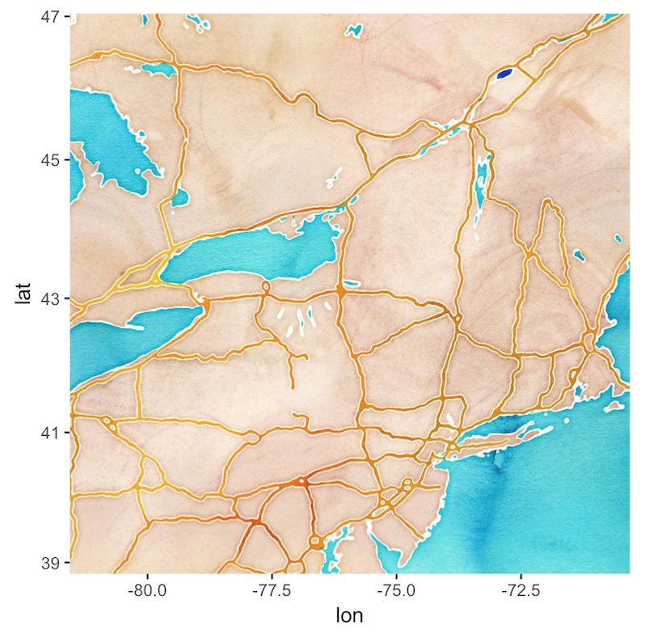
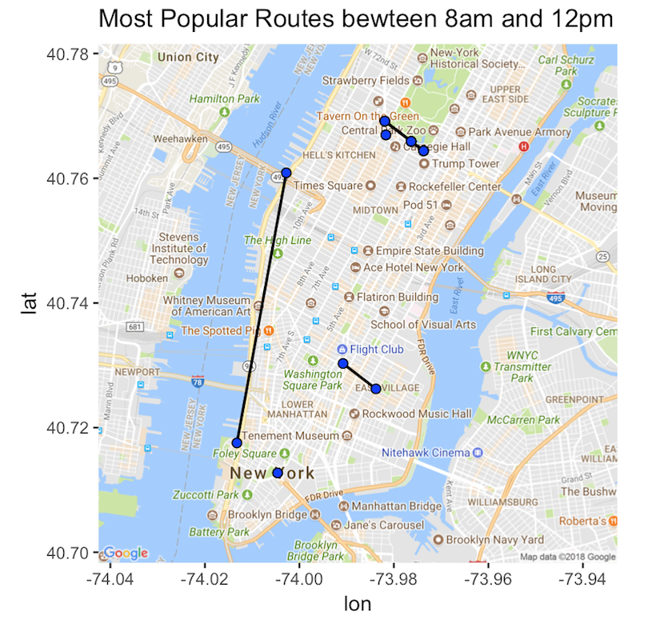
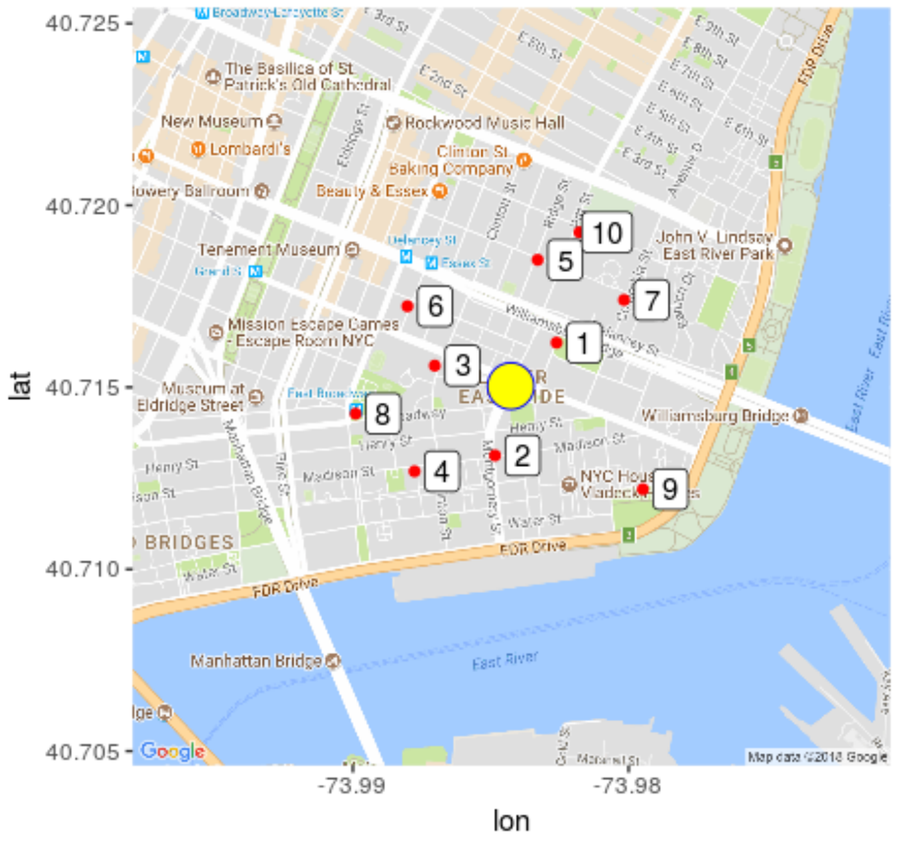
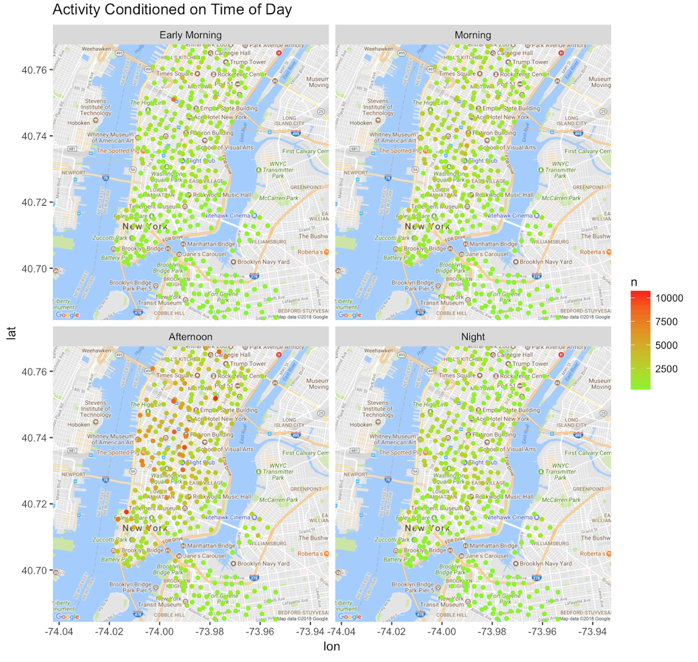
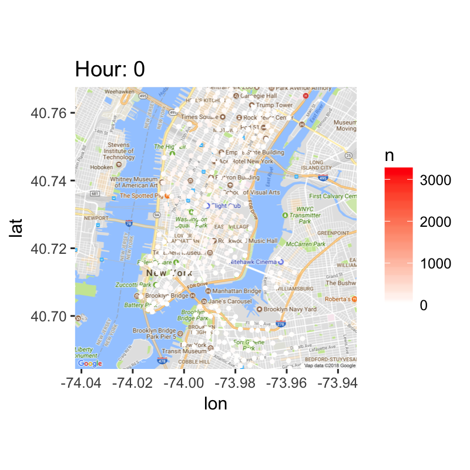

# Working with Location Data & ggmap
Authors: Pit Kauffmann, Ramy Jaber

Working with geographical data can be both a blessing and a curse, so please enjoy the following tutorial on how to deal with location data and how to use ggmap to make some nice graphs. 

### Part 1: Working with Geographical Data

The main focus here will be on location data encoded as latitude, longitude. For the purpose of this tutorial, we will be working with the NYC citibike data, found [here](https://s3.amazonaws.com/tripdata/index.html). Speficially, we are using the data for May 2015, which looks as follows:

``` r
data = read.csv("201505-citibike-tripdata.csv")
str(data)
```
    'data.frame':	961986 obs. of  15 variables:
     $ tripduration           : int  415 1523 642 367 2734 359 236 1991 101 1070 ...
     $ starttime              : Factor w/ 728411 levels "5/1/2015 00:00:11",..: 1 2 5 3 4 7 6 8 10 9 ...
     $ stoptime               : Factor w/ 730072 levels "5/1/2015 00:03:40",..: 4 56 12 3 144 5 2 92 1 35 ...
     $ start.station.id       : int  477 293 380 537 426 439 401 532 320 297 ...
     $ start.station.name     : Factor w/ 327 levels "1 Ave & E 15 St",..: 289 196 288 203 320 130 28 243 201 105 ...
     $ start.station.latitude : num  40.8 40.7 40.7 40.7 40.7 ...
     $ start.station.longitude: num  -74 -74 -74 -74 -74 ...
     $ end.station.id         : int  442 324 507 280 327 302 438 529 276 316 ...
     $ end.station.name       : Factor w/ 327 levels "1 Ave & E 15 St",..: 279 89 119 97 260 33 252 290 95 170 ...
     $ end.station.latitude   : num  40.7 40.7 40.7 40.7 40.7 ...
     $ end.station.longitude  : num  -74 -74 -74 -74 -74 ...
     $ bikeid                 : int  17012 17390 15003 14788 21068 17406 15005 15566 19245 18382 ...
     $ usertype               : Factor w/ 2 levels "Customer","Subscriber": 2 1 2 2 2 2 2 2 2 2 ...
     $ birth.year             : int  1981 NA 1990 1978 1956 1961 1971 1993 1958 1965 ...
     $ gender                 : int  1 0 1 1 2 1 1 1 1 1 ...

The columns we will be focusing on are the start and end station latitudes and longitudes. Luckily in our case, we have all the location data, yet sometimes we may only be given partial information. Thankfully, ggmap has a built-in function that can very easily provide coordinates for certain locations. For example, if we wish to find the coordinates of Tulsa, OK and Munich, Germany, we would do the following:

```r
library(ggmap)
city_1 = "Tulsa, OK"
geocode(city_1)
```
    lon             lat
    <dbl>           <dbl>
    -95.99278       36.15398	

```r
city_2 = "Munich, Germany"
geocode(city_2)
```
    lon             lat
    <dbl>           <dbl>
    11.58198        48.13513

The function is relatively flexible. We could have also said "Tulsa, Oklahoma" or "Munich, GE". Besides for city locations, the function can also retun more specific lat/lon pair, down to specific street addresses or known locations, for example:

```r
location_1 = "one infinite loop, cupertino"
geocode(location_1)
```
    lon             lat
    <dbl>           <dbl>
    -122.0308       37.332		

```r
location_2 = "Columbia University"
geocode(location_2)
```
    lon             lat
    <dbl>           <dbl>
    -73.96257       40.80754	

Pretty neat right!

Along with ggmap, another package, geoSphere, is extemely useful when manipulation geographic data. Most commonly, calculating distance between two GPS points.

We can use distGeo() to get the distance in meters between two pairs of GPS coordinates.

```r
library(geosphere)
a <- c(-73.50, 42.11)
b <- c(-73.47, 42.12)

distGeo(a,b)
```
	[1] 2718.336

Now, that we know what cool things we can do to prepare our dataset, we can move on to make some maps.

### Part 2: Working with ggmap

ggmap is part of the Grammar of Graphics library package, so you get all the perks of gg and can easily combine ggmap with other ggplot graphs, as we will see shortly. The basic structure of how ggmap works is not particularly intuitive, so we'll quickly go over the setup before we get to the good stuff. Before actually being able to use the ggmap() function, we need to create a map object that tells ggmap what to plot. This is done as follows:

```r
map <- get_map(location = c(lon = -75.5, lat = 43.2), 
                 source = "google", 
                 maptype = "roadmap", 
                 crop = FALSE,
                 zoom = 7)
ggmap(map)
```


The main arguments for the get_map function are as follows:
* location: a list of a lat/lon pair. This pair essentially tells ggmap where to center its plot. In our case, we have chosen the coordinates, such that we can see New York State.
* source: can be either "goole", "osm", "stamen" or "cloudmade". This defines where ggmap is pulling the actual maps from.
* maptype: this defines the basic style of the displayed map. Maptype and source go together, hence not all combinations of are possible.
* zoom: this tells ggmap what area around the center to plot. Increase for zooming in, decrease for zooming out. Note that the zoom is pretty sensitive, so decreasing by what seems to be a small number will have a large effect.

By playing with the above 4 features, we can create some basic maps to start with, for example:

```r
# Zoom out
map_1 <- get_map(location = c(lon = -75.5, lat = 43.2), 
                 source = "google", 
                 maptype = "roadmap", 
                 crop = FALSE,
                 zoom = 3)
ggmap(map_1)
```



```r
# Use a different source and map type
map_2 <- get_map(location = c(lon = -75.5, lat = 43.2), 
                 source = "stamen", 
                 maptype = "watercolor", 
                 crop = FALSE,
                 zoom = 7)
ggmap(map_2)
```



Note that you might get some strange error messages if you are not running the most up-to-date version of R. 
Once, we have created a map object, ggmap contains a function that let's us inspect the bounding box used to create the map. For example, for the "map_2" created above, the bounding box (coordinates of lower left and upper right corner) can be obtained as follows:

```r
attr(map_2, "bb")
```
    ll.lat          ll.lon          ur.lat          ur.lon
    <dbl>           <dbl>           <dbl>           <dbl>
    38.82259        -81.5625    	47.04018    	-70.3125

So far we have created some cool maps, but they're not really showing anything that I can't get from going to maps.google.com, so let's actually plot some things. Let's try to find which stations were most used during the Morning, defined as between 8am and 12pm.

```r
library(dplyr)
library(lubridate)

# Create time of day categories
time_of_day <- data %>% as.tbl %>% select(start.station.id, end.station.id, start.station.latitude,
  start.station.longitude, end.station.latitude, end.station.longitude, starttime) %>% mutate(start_time =
  {starttime %>% as.character %>% mdy_hms %>% hour}) %>% mutate(time_of_day = cut(start_time, breaks = c(-1, 8,
  12, 18, 24), labels = c("Early Morning", "Morning", "Afternoon", "Night")))

# Get all rides from the "Morning" category
time_of_day <- subset(time_of_day, time_of_day == "Morning")

# Obtain 10 busiest routes
most_pop <- time_of_day %>% mutate(count = 1) %>% group_by(start.station.id, end.station.id,
  start.station.latitude, start.station.longitude, end.station.latitude, end.station.longitude) %>% tally %>%
  ungroup %>% arrange(desc(n)) %>% slice(1:10) 

# Create map object
myRoutes <- get_map(location = c(lon = -73.98767495, lat = 40.74), 
                    source = "google", 
                    maptype = "roadmap", 
                    zoom = 13)

# Plot the stations
ggmap(myRoutes) + geom_segment(data = most_pop,
                               aes(x = start.station.longitude, 
                                   y = start.station.latitude, 
                                   xend = end.station.longitude, 
                                   yend = end.station.latitude), 
                               colour = "black", lwd = 0.7) +
                  geom_point(data = most_pop, aes(x = start.station.longitude, y = start.station.latitude),
                             fill = "blue", shape = 21, size = 2) + 
                  geom_point(data = most_pop, aes(x = end.station.longitude, y = end.station.latitude), 
                             fill = "blue", shape = 21, size = 2) + 
                  labs(title = "Most Popular Routes bewteen 8am and 12pm")
```



Here, routes that have the same start and end point are simply shown as a dot. Unfortuntely, this is the best we can do with the given data when it comes to plotting the routes. Since we have no location data for the actual trip, we can only plot the start and end locations. 


Now, lets find the 10 closest CitiBike Stations to a particular location (var: myLoc). For the purpose of this tutorial, we will get the unique station list from the original trips data using the "start.station.id" feature. Remember this is from 2015, so many new stations are not included. In practice, we probably want to get the most updated list of stations. 

Notice how we apply the distGeo() function to add a column with the distance between the selected location, and each stations. 

We can also add labels to the map to make the order of closesness clear to the reader. 

```r
# Get station list
stations <- data[order(data[,'start.station.id']),]
stations <- stations[!duplicated(stations$start.station.id),]

# Set current address
myLoc <- "lower east side, NY"
currLoc <- geocode(myLoc)

# Get closest stations
stations$distFromCurr <- c(0, sapply(2:nrow(stations), function(rownumber) {distGeo(currLoc,  
			 c(stations$start.station.longitude[rownumber], 
			 stations$start.station.latitude[rownumber]))}))

closeStations <- head(arrange(stations,distFromCurr), n = 11)[2:11,]
closeStations$rank <- as.numeric(row.names(closeStations)) - 1

# Create map object
map <- get_map(location = currLoc, 
               source = "google", 
               maptype = "roadmap", 
               zoom = 15)

# Plot the map and include labels
ggmap(map) + geom_point(data = closeStations, aes(x = start.station.longitude, 
						  y = start.station.latitude), color = "red") +
  	     geom_label(data = closeStations, aes(x = start.station.longitude, 
	     					  y = start.station.latitude, label = rank), nudge_x = .001) +
  	     geom_point(data = currLoc, aes(x = lon, y = lat), shape = 21, size = 8, color = "blue", 
	     		fill = "yellow")
```



Let's now take a look at which stations are most used (as both start and end stations) during different segments of the day. Since ggmap is part of the Grammar of Graphics set of packages, we can easily apply "fact-wrap" as we would for any other ggplot.

```r
# Create a new dataset that contains a row for each start station and each end station
s.s.loc <- select(data, start.station.id, start.station.latitude, start.station.longitude, starttime,
  tripduration) %>% mutate(id = as.factor("start")) %>% as.tbl
e.s.loc <- select(data, end.station.id, end.station.latitude, end.station.longitude, stoptime, tripduration) %>%
  mutate(id = as.factor("end")) %>% as.tbl

names(s.s.loc) <- c("station", "lat", "long", "time", "tripduration", "pos")
names(e.s.loc) <- c("station", "lat", "long", "time", "tripduration", "pos")

# Bind all the stations and break them into four time of day segments
locs <- rbind(e.s.loc, s.s.loc) %>% as.tbl %>% mutate(time =
  {time %>% as.character %>% mdy_hms %>% hour}) %>% mutate(time_of_day = cut(time, breaks = c(-1, 8,
  12, 18, 24), labels = c("Early Morning", "Morning", "Afternoon", "Night")))

# Count how often each station is used for each of the time of day categories
locs.w.time <- locs %>% group_by(station, time_of_day, lat, long) %>% tally 

stations <- get_map(location = c(lon = -73.98767495, lat = 40.72603999), 
                    source = "google", 
                    maptype = "roadmap", 
                    zoom = 13)

# Plot the stations
ggmap(stations) + geom_point(aes(x = long, y = lat, colour = n), data = locs.w.time, size = 1.3) + 
                  facet_wrap( ~ time_of_day) + 
                  scale_color_gradient(low = "#7CFC00", high = "#FF0000") + 
                  labs(title = "Activity Conditioned on Time of Day")
```



Finally, if you want to do something a little more involved, let's try to create a timelapse map that shows how the usage of the different stations changes over the course of a day. We can do so by creating 24 maps that each show the station usage during a specific hour of the day. We then create an APNG file from the saved images at a website like [this](https://ezgif.com/apng-maker) and upload it. Using the "station" map object we created above, this will look as follows:

```r
for (i in 1:24) {
  tlocs <- filter(locs.w.time, time == levels(locs.w.time$time)[i])
  ggmap(stations) + geom_point(aes(long, lat, colour = rank(n)), size = 0.8, data = tlocs) + 
                    scale_color_gradient(low = "white", high = "red") + 
                    labs(title = paste("Hour:", levels(locs.w.time$time)[i]), cex.names = 0.75)
  ggsave(filename = paste("start", i, ".png", sep = ""), width = 4, height = 4, dpi = 200)
}
```




